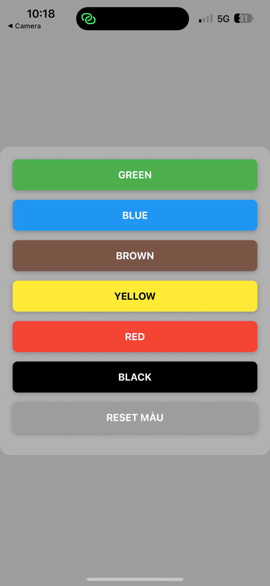
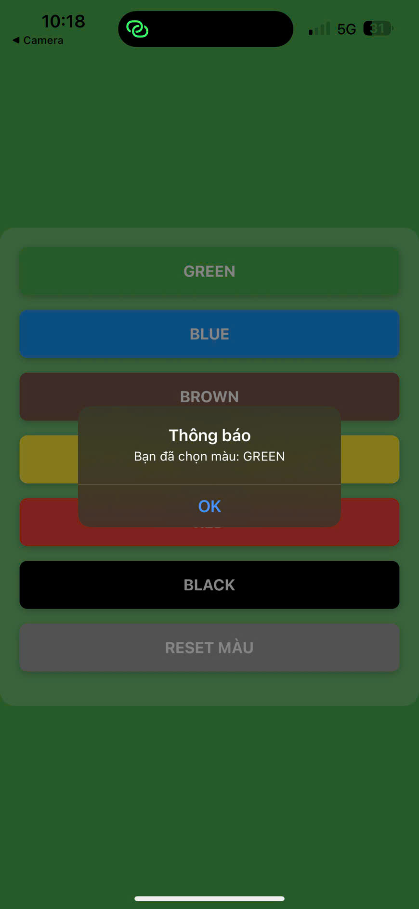
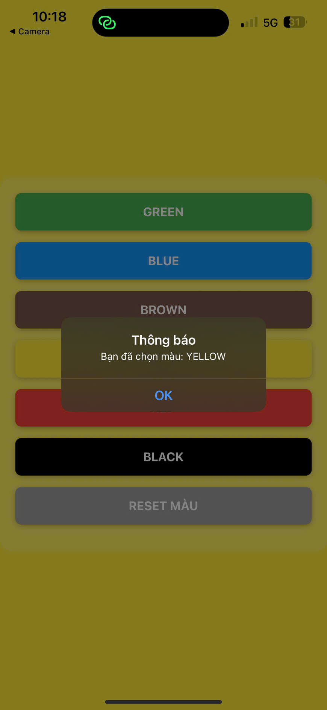

# BÁO CÁO BÀI TẬP BUỔI 5: STATE, PROPS & CALLBACK

## 1. Thông tin sinh viên
* **Họ và tên:** Lê Đức Tài
* **Mã sinh viên:** 23810310296
* **Lớp:** D18CNPM4

---

## 2. Nội dung bài tập
Dựa trên yêu cầu của **Giáo trình Buổi 5** (Slide):
* **Mục tiêu:** Làm quen với `useState`, ôn tập `Props` và `Callback`.
* **Yêu cầu:** 1. Tạo các Button tái sử dụng (Reusable Component).
                2. Khi bấm vào Button, hiển thị `Alert` thông báo tên màu.

---

## 3. Kỹ thuật đã sử dụng
* **Reusable Component:** Tách nhỏ component `ColorButton` để tái sử dụng code, truyền màu sắc và tiêu đề qua `Props`.
* **State (useState):** Sử dụng Hook `useState` để lưu trữ và cập nhật trạng thái màu nền của ứng dụng (`bgColor`).
* **Callback Function:** Truyền hàm từ Component cha xuống con để nhận dữ liệu (mã màu) khi người dùng bấm nút.
* **StyleSheet:** Thiết kế giao diện phẳng, hiện đại với hiệu ứng đổ bóng (`elevation/shadow`) và bo góc.

---

## 4. Kết quả Demo (Ảnh chụp màn hình)

### 4.1. Giao diện chính
Giao diện mặc định với danh sách các nút màu sắc.

### 4.2. Chức năng đổi màu & Alert
Khi bấm vào nút **GREEN**, nền đổi sang màu xanh và hiện thông báo.

Khi bấm vào nút **YELLOW**, nền đổi sang màu vàng (chữ nút màu đen) và hiện thông báo.

---
